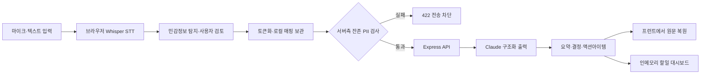

# Hackathon(CodeGate 2026) · VeilNote

민감한 회의 원문과 오디오를 기기 밖으로 보내지 않고, 브라우저에서 비식별화한 텍스트만 LLM에 전달하는 회의록·업무 실행 에이전트입니다.

코드게이트 AI 스타트업 해커톤에서 팀 TRACEGATE가 개발했습니다. 이상민은 **백엔드 API와 LLM 연동을 중심으로 개발하고, 프런트엔드와 백엔드의 요청·응답 흐름을 연결**했습니다.

> 이 저장소는 개인 포트폴리오용 미러입니다. 실제 코드는 팀 원본 저장소 [`TRACEGATE/hackathon_2026`](https://github.com/TRACEGATE/hackathon_2026)의 `main` 브랜치 `7619bc1`을 기준으로 반영했습니다.

## Project Summary

| 항목 | 내용 |
| --- | --- |
| 행사 | 코드게이트 AI 스타트업 해커톤 |
| 팀 | TRACEGATE |
| 서비스 | VeilNote |
| 담당 | 백엔드 API, Claude 연동, 서버측 개인정보 유출 게이트, 프런트엔드 연동 |
| 핵심 가치 | 오디오·원문·토큰 매핑은 로컬에 두고 서버에는 토큰화된 텍스트만 전송 |
| 백엔드 | Node.js 20+, Express 4, Anthropic SDK, 순수 ESM |
| 프런트엔드 | React 19, TypeScript, Vite, Transformers.js, Web Audio API |

## Architecture



## My Contribution

### Backend

- `POST /api/process-meeting`을 중심으로 회의 처리 API를 구성했습니다.
- API 키가 브라우저에 노출되지 않도록 Claude 호출을 Express 백엔드로 분리했습니다.
- 요약, 결정사항, 액션아이템, 개인 STAR 기록을 한 번의 구조화된 LLM 응답으로 받도록 JSON Schema를 연결했습니다.
- 이메일·전화번호·주민등록번호·카드번호가 토큰화되지 않고 남으면 LLM 호출 전에 `422`로 차단하는 서버측 게이트를 적용했습니다.
- 액션아이템을 추가 호출 없이 할일 레코드로 변환하고 조회·수정·삭제할 수 있도록 인메모리 업무 저장소를 연결했습니다.
- 토큰을 변경한 전사 교정 결과는 폐기하고, JSON 파싱 실패는 한 번만 재시도하도록 방어 로직을 구성했습니다.

### Frontend Integration

- `VITE_API_BASE_URL`을 통해 프런트엔드와 백엔드 주소를 분리했습니다.
- `fetch` 요청을 `/api/process-meeting` 계약에 맞추고 네트워크·검증·서버 오류를 화면 상태로 연결했습니다.
- 브라우저에서 토큰 매핑을 보관하고 서버 응답을 렌더링 직전에 재귀적으로 복원하는 흐름을 연결했습니다.
- 온디바이스 Whisper 결과가 탐지 → 사용자 검토 → 토큰화 → API 요청으로 이어지도록 통합했습니다.

## Security Flow

1. 오디오는 브라우저의 Web Worker에서 Whisper로 처리합니다.
2. 규칙·사전 기반 탐지 결과를 사용자가 확인하고 수정합니다.
3. 회사명, 인명, 금액을 `[ORG_1]`, `[PERSON_1]`, `[AMOUNT_1]` 형태로 치환합니다.
4. 원문과 토큰 매핑은 브라우저에만 유지합니다.
5. 백엔드는 잔존 PII를 다시 검사한 뒤 통과한 요청만 Claude에 전달합니다.
6. Claude는 토큰을 유지한 구조화 JSON을 반환합니다.
7. 프런트엔드는 화면 표시 직전에 로컬 매핑으로 원문을 복원합니다.

## API

| Method | Endpoint | 역할 |
| --- | --- | --- |
| `GET` | `/health` | 서버·모델·API 키 설정 상태 확인 |
| `POST` | `/api/process-meeting` | 토큰화 회의록을 요약·결정·업무·STAR 결과로 변환 |
| `GET` | `/api/tasks` | 할일 목록, 필터, 집계 조회 |
| `GET` | `/api/tasks/:id` | 할일 단건 조회 |
| `PATCH` | `/api/tasks/:id` | 상태·내용·담당자·우선순위 수정 |
| `DELETE` | `/api/tasks/:id` | 할일 삭제 |
| `POST` | `/api/demo/detect` | 데모용 민감정보 탐지 |
| `POST` | `/api/demo/tokenize` | 데모용 토큰화 |
| `POST` | `/api/demo/restore` | 데모용 복원 |

상세 계약은 [`backend/docs/API_SPEC.md`](./backend/docs/API_SPEC.md)를 참고하세요.

## Quick Start

### 1. Backend

```bash
cd backend
npm ci
cp .env.example .env
# .env의 ANTHROPIC_API_KEY를 실제 키로 변경
npm start
```

백엔드는 기본적으로 `http://localhost:3000`에서 실행됩니다. API 키가 없어도 `npm run demo`로 LLM 호출 직전까지 보안·토큰화 흐름을 확인할 수 있습니다.

### 2. Frontend

```bash
cd frontend
npm ci
npm run dev
```

프런트엔드는 기본적으로 `http://localhost:3000`의 백엔드를 호출합니다. 다른 주소를 사용할 때는 `VITE_API_BASE_URL`을 설정합니다.

## Repository Structure

```text
.
├── backend/
│   ├── src/
│   │   ├── server.js
│   │   ├── meetingProcess.js
│   │   ├── taskStore.js
│   │   └── shared/
│   ├── scripts/demo.js
│   ├── docs/API_SPEC.md
│   └── package.json
├── frontend/
│   ├── public/
│   ├── src/
│   │   ├── components/
│   │   ├── hooks/
│   │   └── lib/
│   └── package.json
├── docs/
├── demo/
└── README.md
```

## Custom Code and Library APIs

프로젝트에서 직접 작성한 주요 함수는 다음과 같습니다.

- 백엔드: `processMeeting`, `buildMeetingUserPrompt`, `dropTokenTouchingCorrections`, `scanResidualPII`, `addTasksFromActionItems`, `updateTask`
- 프런트엔드: `detectEntities`, `tokenizeFromEntities`, `restoreDeep`, `applyCorrections`, `processMeeting`
- 음성 처리: `MeetingRecorder`, `resampleTo16k`, `collapseRepeats`, `getTranscriber`

라이브러리와 표준 API는 직접 재구현하지 않았습니다.

- Express: `express()`, `express.json()`, `app.get/post/patch/delete`, `express.static`
- Anthropic SDK: `new Anthropic()`, `anthropic.messages.create()`
- React: `useState`, `useMemo`와 컴포넌트 렌더링
- Transformers.js: `pipeline`, `env`
- 브라우저 표준: `fetch`, `AudioContext`, `AudioWorkletNode`, `Worker`

구체적인 입력·출력 형식과 함수별 책임은 [코드 및 API 해설](./docs/CODE_AND_API_GUIDE.md)에 정리했습니다.

## Documents

- [프로젝트 포트폴리오](./docs/PORTFOLIO.md)
- [코드 및 API 해설](./docs/CODE_AND_API_GUIDE.md)
- [소스 및 출처 기록](./docs/SOURCE_INVENTORY.md)
- [팀 저장소 원본 README](./docs/TEAM_REPOSITORY_README.md)
- [개발 명세서](./docs/VeilNote_Development_Spec_v2.docx)
- [API 명세서 PDF](./docs/VeilNote_API_Spec.pdf)
- [데모 영상](https://github.com/min-1225/Hackathon-CodeGate-2026/releases/tag/v0.1.0-demo)

## Verification

```bash
cd backend
npm ci
npm run demo

cd ../frontend
npm ci
npm run build
npm run lint
```

## Current Limitations

- 업무 데이터는 인메모리 저장소를 사용하므로 서버 재시작 시 초기화됩니다.
- 실제 LLM 호출에는 `ANTHROPIC_API_KEY`가 필요합니다.
- 첫 Whisper 실행은 모델 다운로드가 필요하며 WebGPU를 사용할 수 없으면 WASM으로 폴백합니다.
- 팀 공동 프로젝트이므로 별도의 오픈소스 라이선스가 확정되지 않았습니다.
