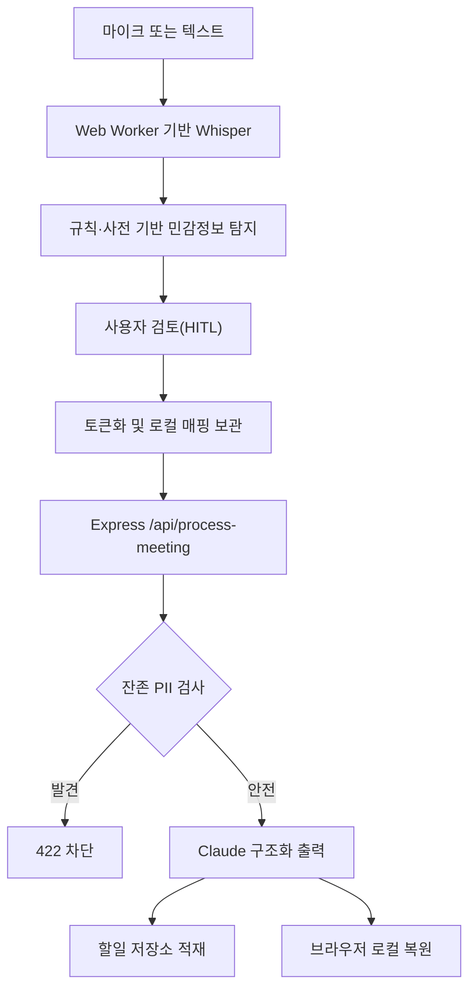

# VeilNote 프로젝트 포트폴리오

## 1. 한 줄 소개

브라우저에서 회의 오디오와 민감정보를 처리하고, 토큰화된 텍스트만 백엔드와 LLM에 전달하는 비식별화 회의록·업무 실행 에이전트입니다.

## 2. 프로젝트 정보

| 항목 | 내용 |
| --- | --- |
| 프로젝트 | VeilNote |
| 행사 | 코드게이트 AI 스타트업 해커톤 |
| 팀 | TRACEGATE |
| 분야 | AI 회의록, 개인정보 보호, 업무 자동화 |
| 담당 | 백엔드 개발 중심, LLM 연동, 보안 게이트, 프런트엔드 연결 |
| 원본 저장소 | [`TRACEGATE/hackathon_2026`](https://github.com/TRACEGATE/hackathon_2026) |
| 반영 기준 | `main` 브랜치 `7619bc1` |

## 3. 문제 정의

일반적인 AI 회의록 서비스는 오디오나 회의 원문을 외부 서버로 전송합니다. 회사명, 고객명, 계약 금액, 연락처가 포함된 기업 회의에서는 이 전송 자체가 보안·도입 장벽이 됩니다.

VeilNote는 다음 질문에서 출발했습니다.

> AI가 회의 내용을 정리하되, AI가 실제 민감정보를 알지 못하게 만들 수 있는가?

## 4. 해결 방식

1. 브라우저에서 Whisper를 실행해 오디오를 로컬에서 텍스트로 변환합니다.
2. 회사명·인명·금액 등의 후보를 규칙과 사전으로 탐지합니다.
3. 사용자가 탐지 결과를 직접 포함·제외하거나 민감정보를 추가합니다.
4. 확정된 값을 `[ORG_1]`, `[PERSON_1]`, `[AMOUNT_1]` 형태로 치환합니다.
5. 백엔드는 이메일·전화번호·주민등록번호·카드번호의 잔존 여부를 다시 검사합니다.
6. 통과한 토큰 텍스트만 Claude에 전달해 요약·결정·액션아이템·STAR 결과를 한 번에 생성합니다.
7. 프런트엔드는 로컬 매핑으로 결과를 복원해 사용자에게 표시합니다.

## 5. 시스템 구조

## 6. 담당 업무

### 6-1. 백엔드

- Express 기반 API 서버와 JSON 요청·응답 계약을 구성했습니다.
- `ANTHROPIC_API_KEY`를 백엔드 환경변수로 격리해 프런트엔드 노출을 막았습니다.
- Claude Structured Output용 시스템 프롬프트와 JSON Schema를 연결했습니다.
- 회의 1건을 전사 교정, 요약, 결정사항, 액션아이템, 개인 STAR 기록으로 변환했습니다.
- 이메일·전화번호·주민등록번호·카드번호가 남은 요청을 `422 RESIDUAL_PII_BLOCKED`로 차단했습니다.
- 액션아이템을 인메모리 할일 레코드로 변환하고 조회·수정·삭제 API를 연결했습니다.
- 모델이 토큰을 변경한 교정 항목은 서버에서 제거하고 JSON 파싱 실패는 한 번만 재시도하도록 방어했습니다.

### 6-2. 프런트엔드 연결

- `VITE_API_BASE_URL`을 통해 개발·배포 환경의 API 주소를 분리했습니다.
- `fetch` 요청을 `/api/process-meeting` 계약과 맞추고 오류 코드별 메시지를 UI로 전달했습니다.
- 토큰 매핑을 요청에 포함하지 않고 브라우저에 유지했습니다.
- 서버의 중첩 JSON 응답을 `restoreDeep`으로 재귀 복원해 결과 화면과 대시보드에 연결했습니다.
- 온디바이스 STT → 탐지 → 사용자 검토 → 토큰화 → API → 복원 흐름을 하나의 사용자 여정으로 연결했습니다.

## 7. 구현 근거

| 경로 | 확인 가능한 구현 |
| --- | --- |
| `backend/src/server.js` | Express 라우트, CORS, 본문 제한, 잔존 PII 차단, 오류 응답 |
| `backend/src/meetingProcess.js` | Anthropic SDK, 시스템 프롬프트, JSON Schema, 교정 방어 |
| `backend/src/taskStore.js` | 인메모리 할일 적재·필터·수정·삭제·집계 |
| `backend/src/shared/` | 정규식 탐지, 토큰화·복원, 유출 검사 |
| `frontend/src/lib/claudeApi.ts` | API 주소 분리, `fetch`, 오류 모델 |
| `frontend/src/lib/tokenizer.ts` | 탐지, 사용자 추가, 토큰화, 깊은 복원 |
| `frontend/src/hooks/useMeetingRecorder.ts` | React와 마이크 모듈 연결 |
| `frontend/public/mic.js` | VAD, 16kHz 리샘플링, Whisper 작업 큐 |
| `frontend/public/whisper-worker.js` | Transformers.js 추론, WebGPU→WASM 폴백, 환각·반복 필터 |

## 8. API 요약

| Method | Endpoint | 설명 |
| --- | --- | --- |
| `GET` | `/health` | 서버 상태와 모델 설정 확인 |
| `POST` | `/api/process-meeting` | 토큰화 회의록 처리와 할일 생성 |
| `GET` | `/api/tasks` | 상태·담당자·회의별 할일 조회 |
| `GET` | `/api/tasks/:id` | 할일 상세 조회 |
| `PATCH` | `/api/tasks/:id` | 할일 상태와 속성 수정 |
| `DELETE` | `/api/tasks/:id` | 할일 삭제 |
| `POST` | `/api/demo/detect` | 데모용 민감정보 탐지 |
| `POST` | `/api/demo/tokenize` | 데모용 토큰화 |
| `POST` | `/api/demo/restore` | 데모용 데이터 복원 |

## 9. 기술적 판단

### 원문과 매핑을 서버에 보내지 않기

서버가 복원 정보를 가지지 않도록 원문과 매핑 테이블은 브라우저에만 유지했습니다. 백엔드 로그도 요청 경로만 기록하고 본문은 기록하지 않습니다.

### 사람의 확인을 보안 흐름에 포함하기

자동 탐지 정확도를 과장하지 않고 사용자가 가릴 항목을 최종 확정하도록 했습니다. 자동화 실패를 사용자의 통제 가능한 단계로 전환한 설계입니다.

### LLM 호출 전에 다시 검사하기

프런트엔드 검사를 신뢰 경계로 보지 않고 백엔드가 잔존 PII를 한 번 더 검사합니다. 차단된 요청은 Claude 호출과 비용 발생 전에 종료됩니다.

### 한 번의 구조화 출력 사용

요약과 업무 추출을 여러 호출로 나누지 않고 하나의 JSON Schema 응답으로 받아 비용과 파싱 불확실성을 줄였습니다.

### 절대 날짜 대신 상대일수 사용

모델은 `dueOffsetDays`만 반환하고 실제 날짜 계산은 클라이언트가 담당하도록 해 요일·연도 환각 가능성을 줄였습니다.

## 10. 기술 스택

### Backend

- Node.js 20+
- Express 4
- Anthropic SDK
- dotenv
- JavaScript ESM

### Frontend

- React 19
- TypeScript
- Vite
- Transformers.js 3.0.2
- Hugging Face `Xenova/whisper-base`
- Web Audio API, AudioWorklet, Web Worker
- Local Storage

## 11. 트러블슈팅

### WebGPU 실패 대응

Whisper 모델을 WebGPU `fp32`로 먼저 실행하고 실패하면 WASM `q8`로 폴백하도록 구성했습니다.

### 반복·환각 결과 억제

`no_repeat_ngram_size`, `repetition_penalty`, 반복 구절 축약, 뉴스·구독 문구 필터를 함께 적용했습니다.

### 토큰 훼손 방지

프롬프트에서 토큰 수정을 금지하고, 모델이 토큰을 건드린 교정 결과는 `dropTokenTouchingCorrections`로 다시 제거했습니다.

### 프런트·백엔드 오류 연결

네트워크 실패, 입력 오류, 잔존 PII, LLM 오류를 `BackendApiError`로 구분해 화면에서 다른 안내를 제공할 수 있게 했습니다.

## 12. 포트폴리오 문장

### 이력서 한 줄

> CodeGate AI 해커톤에서 비식별화 회의록 에이전트 VeilNote의 Express 백엔드와 Claude 구조화 출력, 서버측 개인정보 유출 차단 및 React 프런트엔드 연동을 구현했습니다.

### 상세형

> 회의 원문과 토큰 매핑을 브라우저에 유지하고 토큰화된 텍스트만 서버에 전달하는 아키텍처를 구현했습니다. Express API에서 잔존 개인정보를 재검사하고, Claude Structured Output을 이용해 요약·결정·액션아이템·개인 STAR 결과를 한 번에 생성했습니다. 생성된 업무는 인메모리 대시보드 API에 연결하고 프런트엔드에서는 로컬 매핑으로 결과를 복원했습니다.

### 30초 면접 답변

> 제가 맡은 핵심은 백엔드와 프런트 연결이었습니다. 브라우저에서 원문을 토큰화하고 서버에는 토큰만 보내도록 계약을 맞췄으며, 서버에서는 개인정보 패턴이 남아 있으면 LLM 호출 전에 차단했습니다. Claude 응답은 JSON Schema로 고정해 요약과 액션아이템을 안정적으로 받고, 바로 할일 대시보드로 이어지도록 구현했습니다.

## 13. 한계와 다음 단계

- 할일 데이터는 인메모리이므로 서버 재시작 시 사라집니다.
- LLM 실제 호출에는 Anthropic API 키가 필요합니다.
- 민감정보 탐지는 규칙·사전 기반이라 모든 문맥 의존 개체를 자동 탐지하지 못할 수 있습니다.
- 브라우저 성능과 WebGPU 지원 여부에 따라 Whisper 속도가 달라집니다.
- 다음 단계는 영속 저장소, 인증·권한, 자동 테스트, 배포 환경별 CORS 제한입니다.

## 14. 출처

코드는 팀 원본 저장소의 `main` 브랜치 `7619bc1`을 기준으로 개인 포트폴리오 저장소에 미러링했습니다. 원본 프로젝트의 팀 기여와 이력은 [`TRACEGATE/hackathon_2026`](https://github.com/TRACEGATE/hackathon_2026)에서 확인할 수 있습니다.
